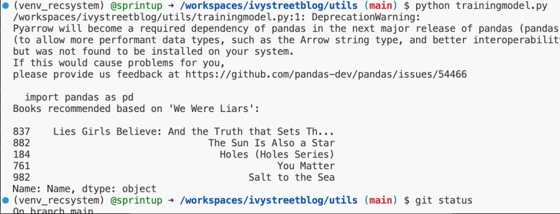

# Overview

This project started due to an assignment in a Children's Literature class, but will serve in the long term as a resource for the community that uses children books as the topic that can be used to practice different technologies. So below there are two parts that separate the concerns of the school project from the concerns of the website as a resource for the little free library. The Adding books to the  is a great first pull request.

## License

This project is licensed under the [Creative Commons Attribution-ShareAlike 4.0 International License (CC BY-SA 4.0)](https://creativecommons.org/licenses/by-sa/4.0/). By contributing to this project, you agree to abide by the terms of this license.

### School Part

There is a resource called [github pages](https://docs.github.com/en/pages/quickstart) that can be used to push a simple index page (just update the [index.html file](https://github.com/sprintup/ivystreetblog/blob/gh-pages/index.html) and push to the `gh-pages` branch), that I can turn into a react page in the main project. This page can be found [here](https://sprintup.github.io/ivystreetblog/)

### Ivy Street Blog (resource for little free library) Website Part

This is a website that accompanies my little free library. It's also an opportunity to practice some open source development, including the use of various tools including AI. The original code was generated from https://github.com/gpt-engineer-org/gpt-engineer

## How to contribute

This project utilizes [dev containers](https://containers.dev/), which is short for 'development containers' which are [docker](https://docs.docker.com/get-started/overview/) containers that are provisioned with all the development dependencies. These containers can be run locally on your own computer using [docker desktop](https://www.docker.com/products/docker-desktop/) using a editor like [VS Code](https://code.visualstudio.com/docs/devcontainers/containers) or remotely (in the cloud) using [Github Codespaces](https://docs.github.com/en/codespaces). If you develop remotely, you should be able to develop using the cloud editor (VS Code) only and shouldn't have to install anything on your actual machine (but some experiences might be a bit more complicated).

Here are [directions for how to open the codespace in github](https://docs.github.com/en/codespaces/developing-in-a-codespace/creating-a-codespace-for-a-repository#creating-a-codespace-for-a-repository). **Don't forget to [stop your codespace](https://docs.github.com/en/codespaces/developing-in-a-codespace/stopping-and-starting-a-codespace#stopping-a-codespace) once you're finished**, otherwise you can burn through all your free time unnecissarily.

If you make it this far, then a standard git workflow should apply (commit changes on a feature branch and make pull request). If you're totally new to git/github, I [created this list of resources](https://github.com/sprintup/blah?tab=readme-ov-file#additional-resources) to follow.

### Codespace breakdown

Once your codespace is running, the project files will be loaded in a linux container running on github and the default editor is [VSCode](https://code.visualstudio.com/docs). You'll be able to manipulate the files and will develop using the terminal, typically using shortcut keys. See [terminal basics](https://code.visualstudio.com/docs/terminal/basics) for more information. Also, [these videos](https://code.visualstudio.com/docs/getstarted/introvideos) look good for learning how to use VSCode for editing.

### Asking questions

- Please use the [issues](https://github.com/sprintup/ivystreetblog/issues) section of the repository to ask any questions. Just make a new issue and I'll answer it there for others to see as well.

### Misc.

The deveopment of features (including just getting the thing to run) is not organized in the issues at this time. If there is interest in collaborating, let me know in the issues and I can organize it publically instead of just keeping track myself.

The first thing I'm going to work on is provisiong a better dev container (it's currently only has python 3 image, which means node is not installed). One of the coolest features is the ML model (hence the python), but this is a project for a class and I need to finish the website part first for a presentation.

### Serving Predictions

## Reference Projects

- [API Design with Node.js V4 - Scott Moss](https://hendrixer.github.io/API-design-v4/)
  - [github](https://github.com/Hendrixer/API-design-v4-course)
- [Web Authentication APIs](https://firtman.github.io/authentication/)

## Docs

- [Next Pages Router](https://nextjs.org/docs/pages/building-your-application/routing)

# Auth Video

Based on this video 

## Extensions used

Name: ES7 React/Redux/GraphQL/React-Native snippets
Id: rodrigovallades.es7-react-js-snippets
Description: Simple extensions for React, Redux and Graphql in JS/TS with ES7 syntax (forked from dsznajder)
Version: 1.9.3
Publisher: rodrigovallades
VS Marketplace Link: https://marketplace.visualstudio.com/items?itemName=rodrigovallades.es7-react-js-snippets

## Cmds

- `npx create-next-app` with `y`
  - no typscript
  - yes ESLint
  - yes tailwind
  - no src directory
  - yes app router
  - no custom import alias
- `npm i next-auth`
  - next version 13.5.4
  - next-auth version ^4.23.2
- `rafce` shortcut withe extension to make component using extension

## Video Notes

- Starting at about **25:40** in the video is where .env is configured, which is not checked into repo.
- https://console.developers.google.com/
- The [NEXTAUTH_SECRET](https://next-auth.js.org/configuration/options#nextauth_secret) is set set to encrypt traffic

# Misc
- [Here is some good caching documentation](https://github.com/vercel/next.js/discussions/54075)
- [Next.js App Router Caching: Explained!](https://www.youtube.com/watch?v=VBlSe8tvg4U)