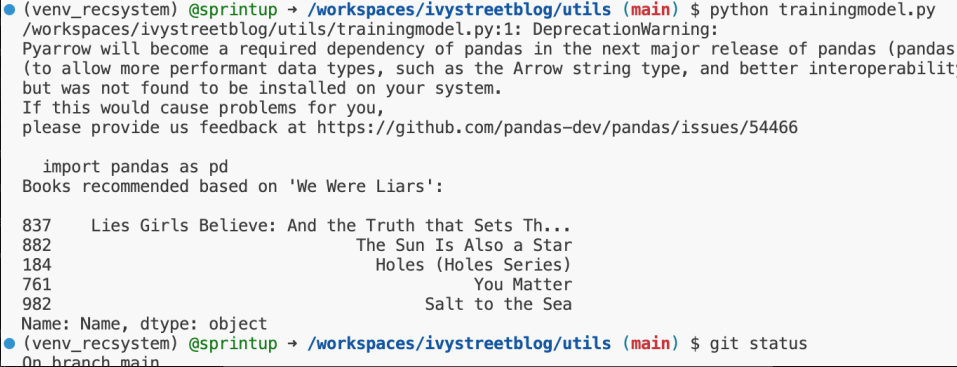

# Ivy Street Blog

This repo started as a Children's Literature class project and has grown into a broader community-facing app. Today it combines:

- bookshelf and reading-list features for a little free library site
- the `Word Garden` teaching helper for caregiver-supported vocabulary and phonemic-awareness practice

The original codebase was bootstrapped from the [gpt-engineer Next.js starter](https://github.com/gpt-engineer-org/gpt-engineer).

If you want an easy first data contribution, updating the [base book dataset](data/books_data.json) is still a good entry point.

## License

This project is licensed under the [Creative Commons Attribution-ShareAlike 4.0 International License (CC BY-SA 4.0)](https://creativecommons.org/licenses/by-sa/4.0/). By contributing to this project, you agree to abide by the terms of this license.

## Main Docs

Project-wide and implementation docs:

- [User Guide](readme-userguide.md)
- [Word Garden Features](readme-features-word-garden.md)
- [Booklists User Guide](readme-booklists-userguide.md)
- [Authentication](readme-authentication.md)
- [API Endpoints](readme-api-endpoints.md)
- [Data Model](readme-data-model.md)
- [Adding A Word](readme-adding-word.md)
- [Adding A Phoneme](readme-adding-phonemes.md)

## Prompt Templates And Generation Logic

If you are looking for the actual prompt-template sources in the code:

- [Word Garden OpenAI worksheet system prompt](app/api/word-garden/generate/route.js#L118)
- [Word Garden OpenAI worksheet user prompt inputs](app/api/word-garden/generate/route.js#L123)
- [Word Garden OpenAI worksheet response schema](app/api/word-garden/generate/route.js#L142)
- [Build-time draw-prompt template logic](data/add-phonemes.js)
- [Runtime word-entry and draw-prompt fallback logic](utils/wordGardenData.js)

## Main App Areas

### Word Garden

Word Garden is the most structured feature set in the repo. It is designed for an adult to use while teaching a child, not as a child self-use app.

Core flow:

1. `Sound Table`
2. `Word Cloud`
3. `Word Page / Checklist / Worksheet`

Start here:

- [Word Garden public info page](app/word-garden-info/page.jsx)
- [Word Garden user guide](readme-userguide.md)
- [Word Garden feature summary](readme-features-word-garden.md)

### Bookshelf / Library Site

The bookshelf side of the app supports:

- private book collections
- booklists
- public bookshelves
- tracked reading lists
- recommendation flows

Start here:

- [API endpoint inventory](readme-api-endpoints.md)
- [Authentication notes](readme-authentication.md)

## Getting Started

### Local development

Useful commands:

```bash
npm run dev
npm run lint
npm run build
npm run start
```

### Dev containers / Codespaces

This project uses [dev containers](https://containers.dev/), which makes it possible to work either:

- locally with Docker Desktop and VS Code
- remotely with [GitHub Codespaces](https://docs.github.com/en/codespaces)

Helpful links:

- [Open a repo in a Codespace](https://docs.github.com/en/codespaces/developing-in-a-codespace/creating-a-codespace-for-a-repository#creating-a-codespace-for-a-repository)
- [Stop a Codespace when finished](https://docs.github.com/en/codespaces/developing-in-a-codespace/stopping-and-starting-a-codespace#stopping-a-codespace)
- [VS Code terminal basics](https://code.visualstudio.com/docs/terminal/basics)
- [VS Code intro videos](https://code.visualstudio.com/docs/getstarted/introvideos)

## How To Contribute

If you are new to the repo:

1. open the project in a dev container or Codespace
2. make changes on a feature branch
3. run lint and build locally
4. open a pull request

If you are new to GitHub workflows, this older resource list may still help:

- [Additional Git/GitHub resources](https://github.com/sprintup/blah?tab=readme-ov-file#additional-resources)

Questions and collaboration requests are best handled through:

- [GitHub Issues](https://github.com/sprintup/ivystreetblog/issues)

## Reference Material

### School / GitHub Pages piece

There is also a separate GitHub Pages artifact tied to the class project:

- [GitHub Pages quickstart](https://docs.github.com/en/pages/quickstart)
- [gh-pages index.html](https://github.com/sprintup/ivystreetblog/blob/gh-pages/index.html)
- [Published GitHub Pages site](https://sprintup.github.io/ivystreetblog/)

### Auth reference video

The original auth setup was based in part on:

- [Next.js Auth - FreeCodeCamp video](https://youtu.be/MNm1XhDjX1s?si=Dg5NwwSuzblyX7kc&t=125)

### Other references

- [API Design with Node.js V4 - Scott Moss](https://hendrixer.github.io/API-design-v4/)
- [API Design with Node.js V4 source](https://github.com/Hendrixer/API-design-v4-course)
- [Web Authentication APIs](https://firtman.github.io/authentication/)
- [Next.js App Router routing docs](https://nextjs.org/docs/pages/building-your-application/routing)
- [Next.js caching discussion](https://github.com/vercel/next.js/discussions/54075)
- [Next.js App Router Caching: Explained!](https://www.youtube.com/watch?v=VBlSe8tvg4U)

## Historical Notes

The repo still contains some notes from the early setup period:

- `npx create-next-app` with App Router and Tailwind
- `next-auth` added during the early auth prototype
- an early VS Code snippet workflow using `rafce`

Those notes were useful during bootstrapping, but the more current guides are the readmes linked above.

## Screenshot


