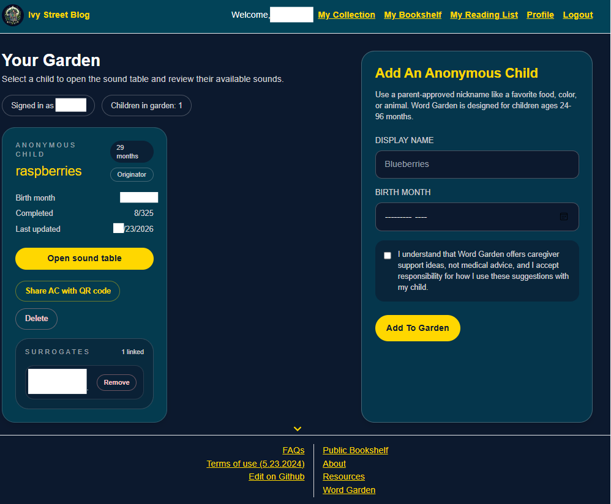
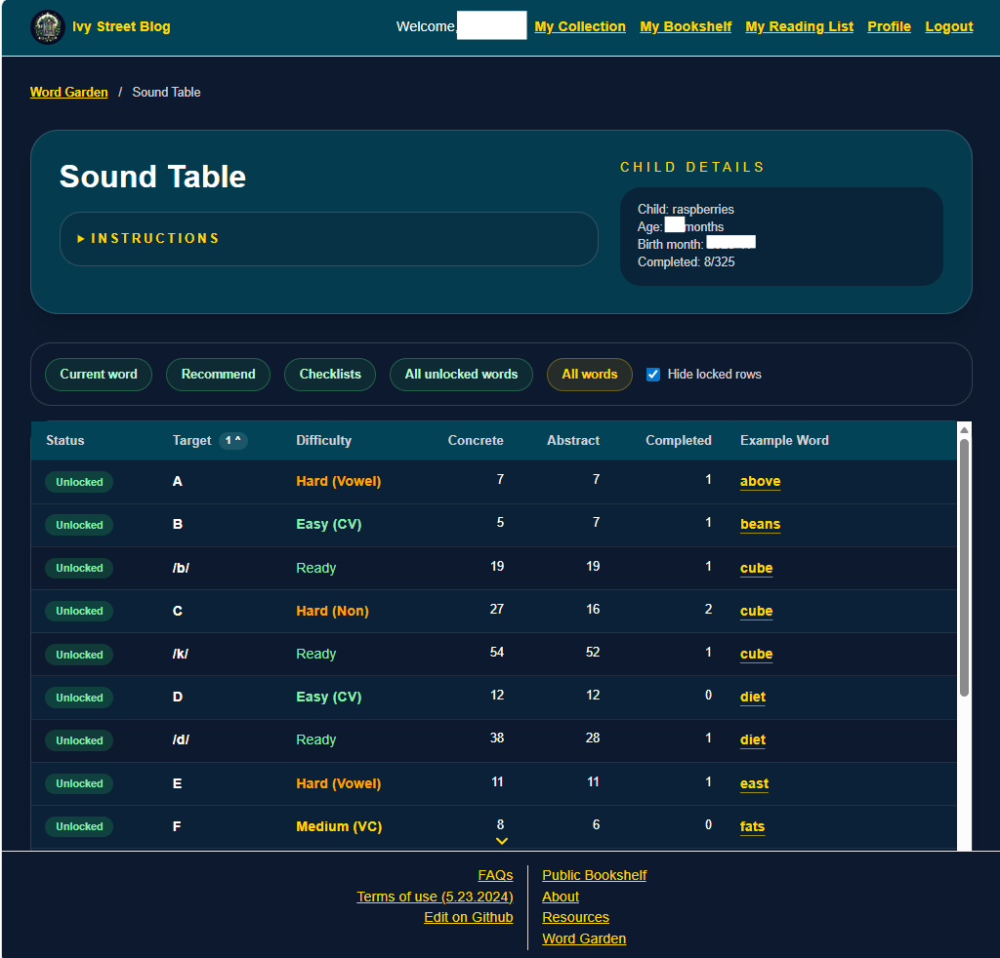
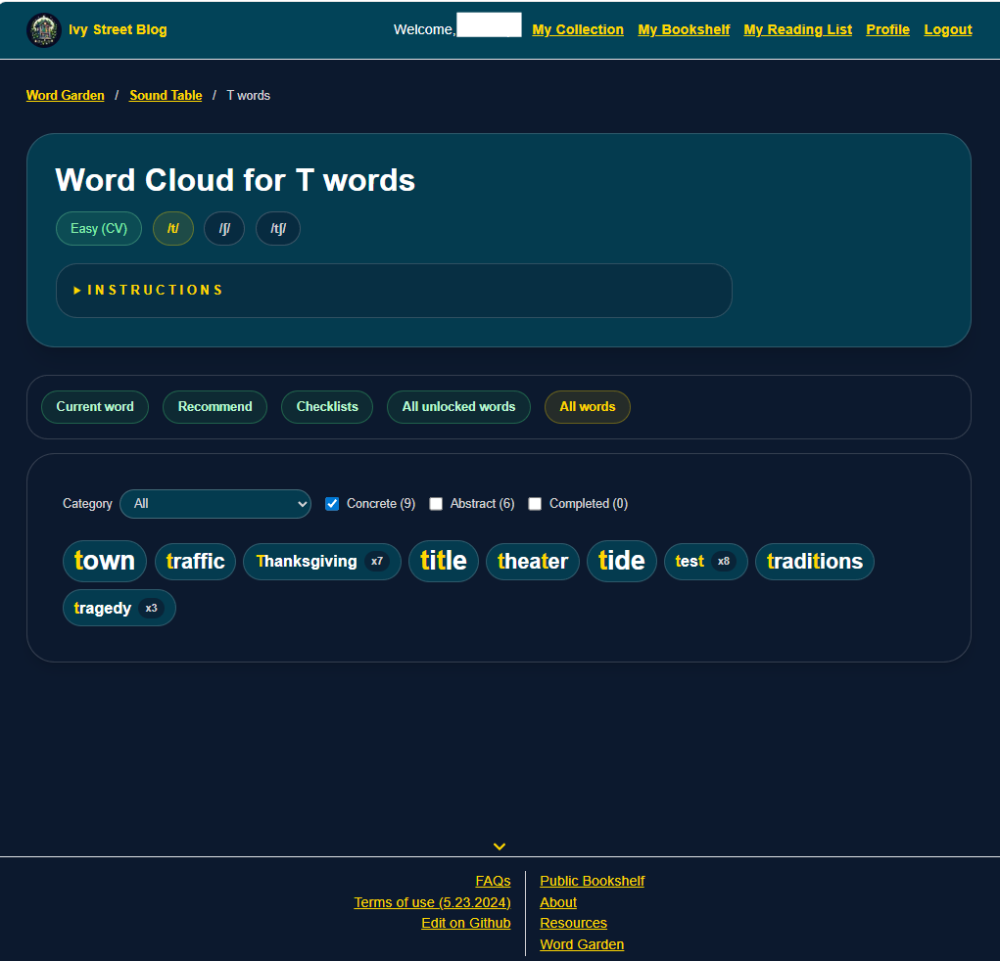
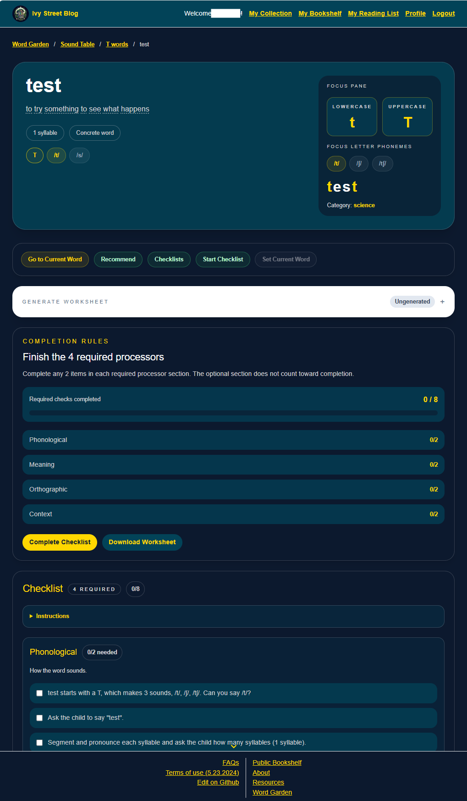
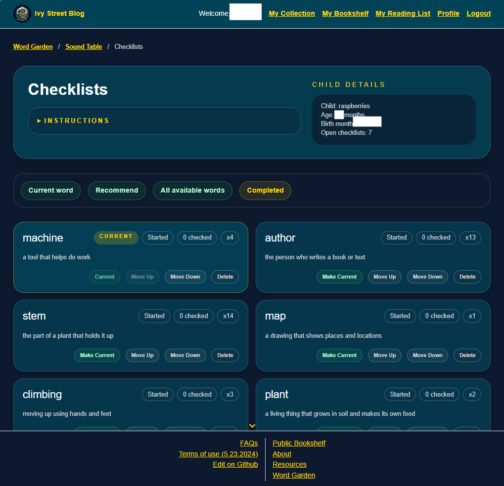

# User Guide

This guide explains how to use the app in practice, with the main focus on Word Garden.

If you are new to the app, the easiest path is:

1. Sign in
2. Open Word Garden
3. Add an anonymous child profile
4. Open the Sound Table
5. Choose a letter or sound
6. Pick a word from the Word Cloud
7. Practice that word on the checklist page

## What The App Does

The app has two main kinds of functionality:

- bookshelf / reading-list features for books
- Word Garden for caregiver-supported vocabulary and phonemic-awareness practice

Word Garden is the most structured part of the app. It helps you move from:

- letters and phonemes
- to words
- to guided practice on a single word

## Signing In

The app currently uses GitHub sign-in.

To get started:

1. Open the app
2. Sign in with GitHub
3. Return to the page you wanted to use

If you try to open a protected Word Garden page while signed out, the app should redirect you to sign in first.

## Word Garden Overview

Word Garden works in three levels:

1. `Sound Table`
Choose a letter or phoneme (sound).

2. `Word Cloud`
See words connected to that letter or sound.

3. `Word Page`
Practice one word using the checklist, strategy panes, and printable worksheet.

In general, yellow text, labels, and pills are there to be clicked.

## Step 1: Open Word Garden

Ways to enter Word Garden:

- open the `Word Garden` page from the app
- open the public Word Garden info page and then go to the dashboard

On the main Word Garden dashboard, you will see your list of anonymous child profiles.

*The dashboard is the home base for each anonymous child profile. This is where you open the sound table, manage sharing, and keep practice organized by child.*

## Step 2: Add An Anonymous Child

Use the add-child form to create a profile.

You will be asked for:

- a parent-approved display name
- the child's birth month
- waiver acceptance

Tips:

- use a nickname rather than a real name
- favorite foods, colors, or animals work well
- the app is designed around children ages 24 to 96 months

After saving, the child appears in `Your Garden`.

## Step 3: Open The Sound Table

From the dashboard, press `Open sound table` on the child tile.

The top of the page shows:

- instructions
- child details
- button shortcuts like `Current word`, `Recommend`, `Checklists`, `All unlocked words`, and `All words`

*The Sound Table is Level 1. It is the main place to choose a letter or phoneme target, sort the rows, and move into the next level.*

## How To Read The Sound Table

The Sound Table is Level 1.

It shows:

- letters
- phonemes in IPA
- difficulty labels
- status
- example words
- suggested word counts
- completed word counts

Helpful ideas:

- letters stay visible even if a sound is not yet unlocked
- unlocked sounds are developmentally available right now
- concrete words are usually a good starting point
- completed counts help you avoid repeating only the same targets

You can:

- click column headers to sort
- shift-click another header for secondary sorting
- hide locked rows
- click a row to move to Level 2

## Sound Table Buttons

### `Current word`

Opens the current active checklist if one exists.

If no checklist is active yet, it falls back to a recommended word.

### `Recommend`

Picks a suggested unfinished word from currently useful targets.

The app tries to exhaust concrete words before abstract words.

### `Checklists`

Opens the page that lists started checklists.

### `All unlocked words`

Shows a broad word cloud using the currently unlocked material.

### `All words`

Shows the full approved Word Garden lexicon.

## Step 4: Use The Word Cloud

The Word Cloud is Level 2.

You reach it by clicking:

- a letter row
- a phoneme row
- one of the broader buttons like `All words`

The title will tell you what you are looking at, for example:

- `Word Cloud for C`
- `Word Cloud for /k/`
- `Word Cloud`

At the top you may see pills showing:

- the current target context
- difficulty or developmental notes
- linked letters or phonemes related to the current view

## Word Cloud Filters

The Word Cloud can be filtered by:

- category
- concrete words
- abstract words
- completed words

Useful patterns:

- start with concrete words when possible
- turn on abstract words later if you want to stretch the set
- turn on completed words if you want to revisit older practice
- use category to narrow the list to a topic

Each word appears as a clickable pill.

The word pills can also show:

- how many times the word was opened
- whether the word has a completed checklist
- highlighted letters or graphemes based on the active target

*The Word Cloud is Level 2. It helps you move from a chosen letter or phoneme into real words, while still showing filters, counts, and highlighted target parts.*

## Step 5: Open A Word Page

Click any word in the cloud to open Level 3.

This is the main practice page for that word.

The word page includes:

- the target word
- definition support
- target/focus pills
- checklist sections
- strategy panes
- worksheet actions
- links back to Level 1 and Level 2

*The Level 3 word page is where the adult does the actual guided teaching work for one word, including focus pills, checklist prompts, strategies, and printable worksheet tools.*

## Focus Pills

The word page includes focus pills for:

- the relevant letter
- supported phonemes in that word

Pressing a focus pill changes what the page emphasizes.

That changes things like:

- highlighted parts of the word
- the first checklist prompt
- the focus pane
- strategy details

This is useful when a single word can teach more than one sound or letter pattern.

## Using The Checklist

The checklist is the main guided-practice area.

It is organized into four required processors:

- Phonological
- Meaning
- Orthographic
- Context

There is also an optional section.

## Completion Rule

To complete the checklist:

- check at least 2 items in each required processor

The optional section does not have to be completed.

## Checklist Status

A word can be:

- `Start Checklist`
- `Started`
- `Complete`

How it works:

- pressing `Start Checklist` opens the checklist without forcing any boxes to be checked
- checking boxes saves your progress
- returning to the word restores saved checkbox state
- pressing `Complete Checklist` marks the word complete

When a section is complete, the completion-rules pane updates its color, and some checklist sections can collapse automatically once they have enough checks.

## Current Word

Each child can have one current word.

This is your main active checklist.

You can set the current word from:

- the Level 3 word page
- the Checklists page

The current word is useful when:

- you want one main practice target across visits
- you want a bookmarkable route
- you want the `Current word` button to jump to the same place every time

Bookmarkable route:

- `/word-garden/[acId]/current`

If there is no current word, that route falls back to a recommended word.

## Checklists Page

The Checklists page shows open/saved checklist words for one child.

You can use it to:

- review all started words
- reopen a word by clicking its tile
- reorder checklist words
- make a different word current
- softly remove a checklist from the list

Each tile can show:

- word
- definition
- checked count
- practice count
- current-word state

This page is a good home base if you are juggling several words at once.

*The Checklists page keeps track of words you have already opened. It is useful when you want to revisit several words, reorder them, or pick which one should be current.*

## Sharing A Child Profile

If you are the originator of a child profile, you can share it.

To share:

1. Open the child tile on the dashboard
2. Press `Share AC with QR code`
3. Use either the QR code or the share link

A surrogate caregiver can:

- scan the QR code
- open the link while signed in
- add the child to their own garden

Important rules:

- only the originator can share
- only the originator can delete the child
- only the originator can remove surrogates

## Printing A Worksheet

The Level 3 word page supports printing.

You do not need generation to print.

To print:

1. Open the word page
2. Use the worksheet controls
3. Download or print the worksheet

The printed worksheet includes:

- the word
- the definition
- pronunciation helper tiles
- required checklist panes
- optional pane
- related words
- drawing space
- a QR code for online completion

## Generating A Worksheet

Generation is optional.

It can make the worksheet richer by adding:

- generated child-friendly wording
- a coloring-page style image
- related-word ideas
- some morphology or language-support content

To generate:

1. Open the word page
2. Find the generate worksheet pane
3. Follow the API key setup instructions
4. Paste your OpenAI API key
5. Press the generate button

Important notes:

- the app does not require generation for printing
- generation usually takes about a minute
- the token is not stored in the database
- some words intentionally have generation disabled

If generation is disabled for a word, the UI will tell you that the generator is unavailable for that word.

## Using The QR Code

The worksheet QR code brings you back to the online word page.

This helps connect paper practice to saved progress.

Typical use:

1. Print the worksheet
2. Practice offline
3. Scan the QR code
4. Review or complete the checklist online

## Related Links And Strategy Panes

The word page includes a number of linked supports.

Depending on the word and focus, you may be able to click:

- letters
- phonemes
- categories
- related words
- glossary terms

These links help you move between:

- the current word
- other words with the same sound
- other words with the same first letter
- category-based word sets

## Good Ways To Use The App With A Young Child

The app works best when it supports short, meaningful caregiver interaction.

Good practice patterns:

- choose a concrete word first
- keep sessions short
- model more than you test
- let the child point, act, repeat, or notice rather than always answer verbally
- revisit the same word across several short sessions
- use the current word feature when you want one ongoing focus
- use the checklists page if you want a small rotating set of words

The app is a teaching support, not a strict script. You do not need to use every prompt every time.

## Troubleshooting

### I cannot open a Word Garden page

Make sure you are signed in.

If you are signed in and still get redirected away, you may not have access to that child profile.

### My checklist boxes did not stay checked

The checklist saves when it is opened or when items are checked. Reopen the same word through its saved path/context when possible.

### `Current word` is not opening the word I expected

If there is no active current word, the app may fall back to a recommendation. Set a word as current from the Level 3 page or Checklists page.

### I do not see sharing controls

Only the originator sees the share button and surrogate management controls.

### Generation is unavailable

Possible reasons:

- no API key was entered
- the word is blocked from generation
- the external generation request failed

You can still print without generation.

## Quick Start Summary

If you want the shortest working path:

1. Sign in
2. Open Word Garden
3. Add an anonymous child
4. Open the sound table
5. Press `Recommend` or choose a target manually
6. Open a word
7. Press `Start Checklist`
8. Check at least 2 items in each required processor
9. Press `Complete Checklist`
10. Return to the sound table and choose the next word

## Suggested First Routine

For a first session with a child:

1. Open the child's sound table
2. Choose an unlocked target with concrete words
3. Open a simple word
4. Start the checklist
5. Do one or two phonological items
6. Do one meaning item
7. Do one orthographic item
8. Do one context item
9. Set the word as current if you want to come back to it
10. Print the worksheet if you want an offline copy

That is usually enough to get started without making the app feel too heavy.
